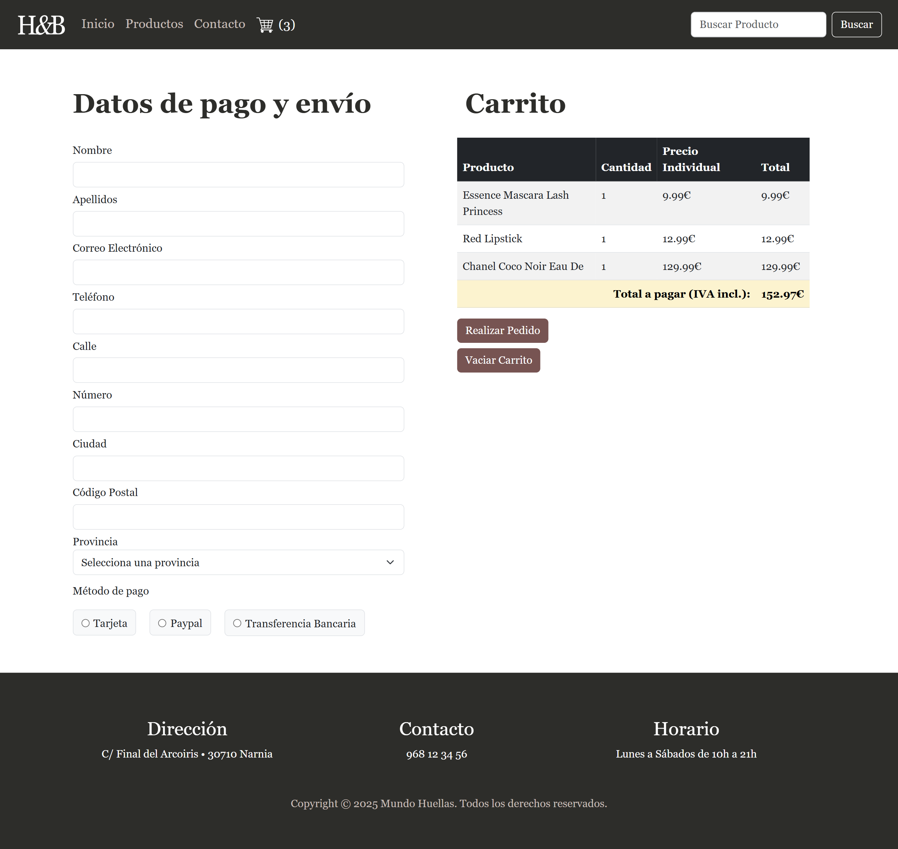
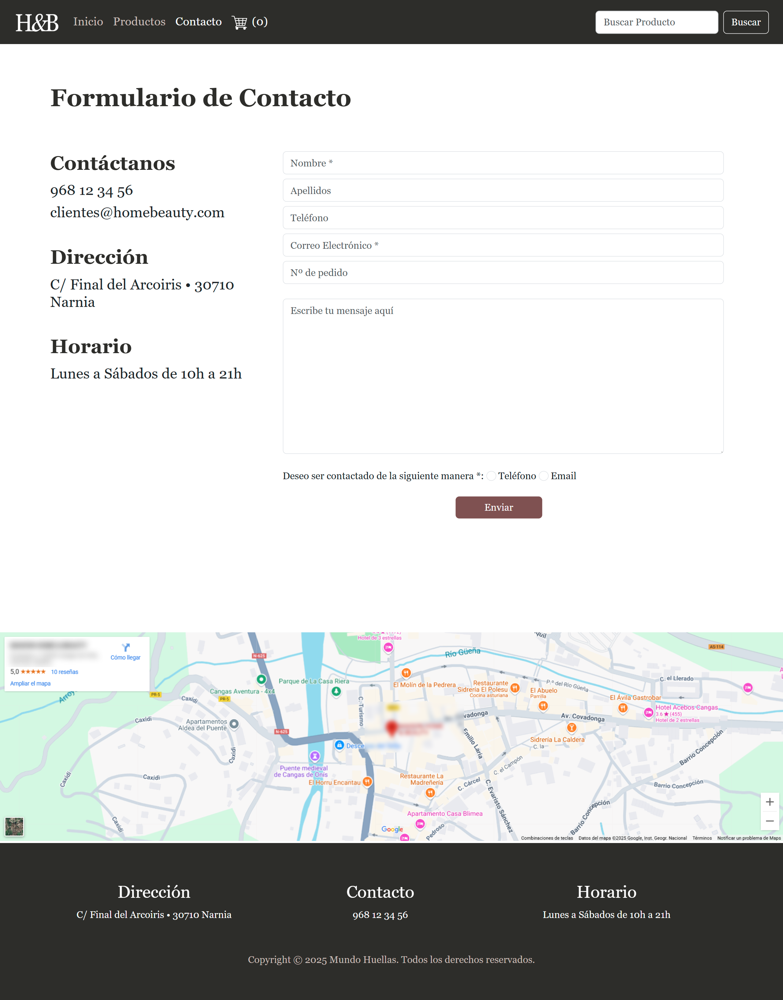

# Product Store Web Application

An online product store web app built with pure HTML, CSS, and JavaScript.  
This project features API integration to dynamically manage product inventory, display products, and handle orders.

**This project was developed as a university assignment as part of my learning process.**

## Technologies Used

- **HTML5**: for the page structure  
- **CSS3**: for styling  
- **JavaScript**: for interactivity and API communication  

## Features

- Dynamic product catalog fetched from an API  
- Shopping cart functionality  
- Order processing simulation
- Desktop-oriented layout (not responsive)  
- Clean and simple user interface  

## Screenshots

  

  

 

  

## How to Run

1. Clone this repository  
2. Open `index.html` in your browser  
3. Ensure the API endpoint is running and accessible for product data  

## API Integration

The app consumes a free external API that provides product information used to:  
- Display product details  
- Update the product catalog dynamically  

## Author

Noelia Cegarra Castillo – [noeliacegarracastillo@gmail.com](mailto:your.email@example.com)  
[GitHub Profile](https://github.com/ccaileon) 
[Linkedin](https://www.linkedin.com/in/noelia-cegarra-castillo/)
